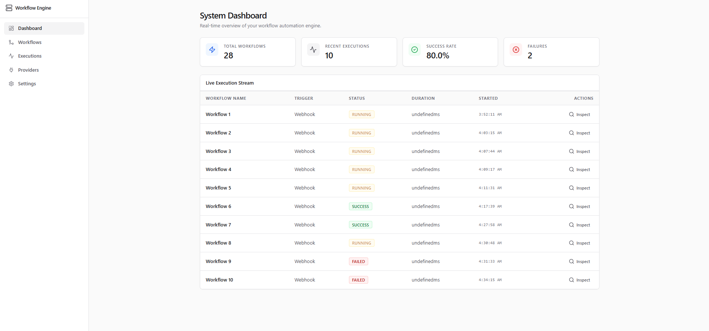
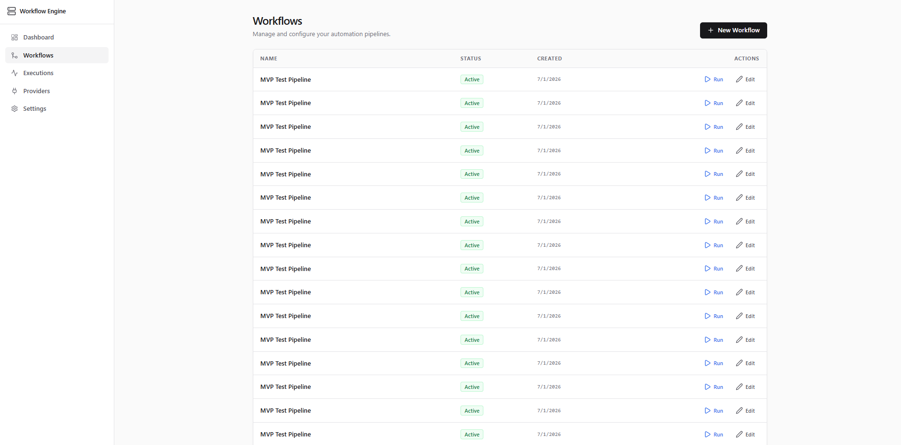
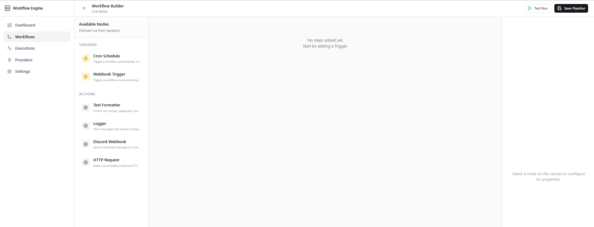
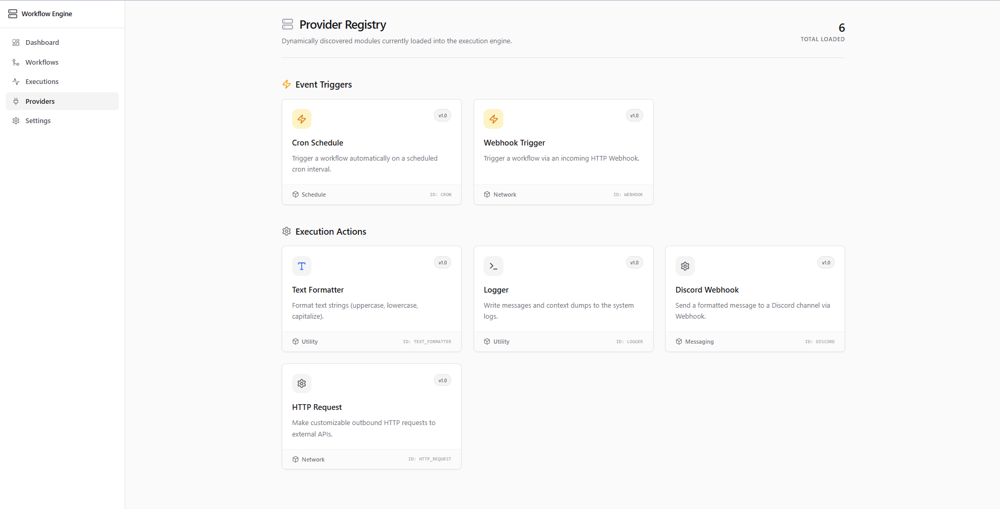
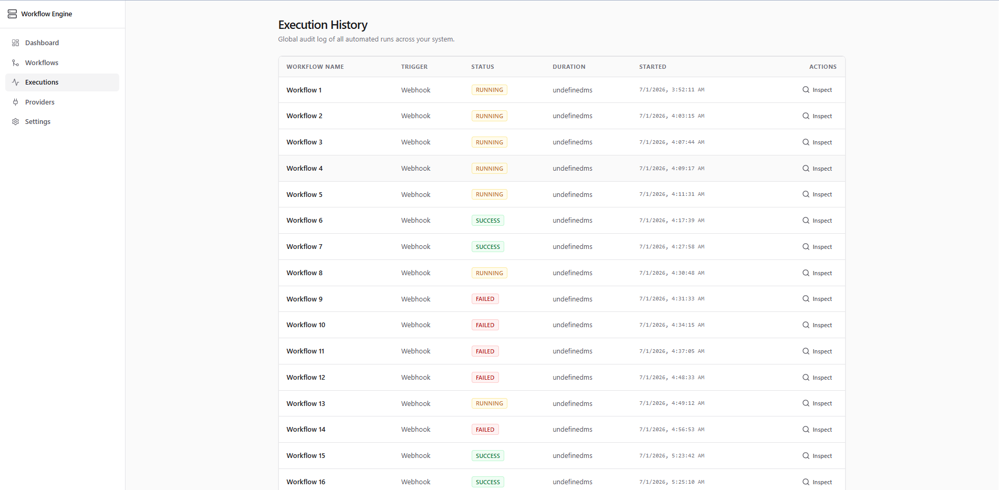
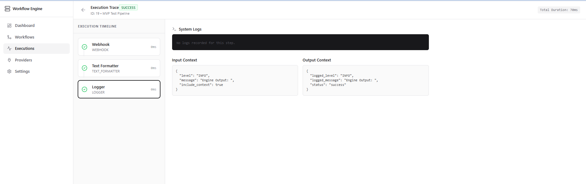
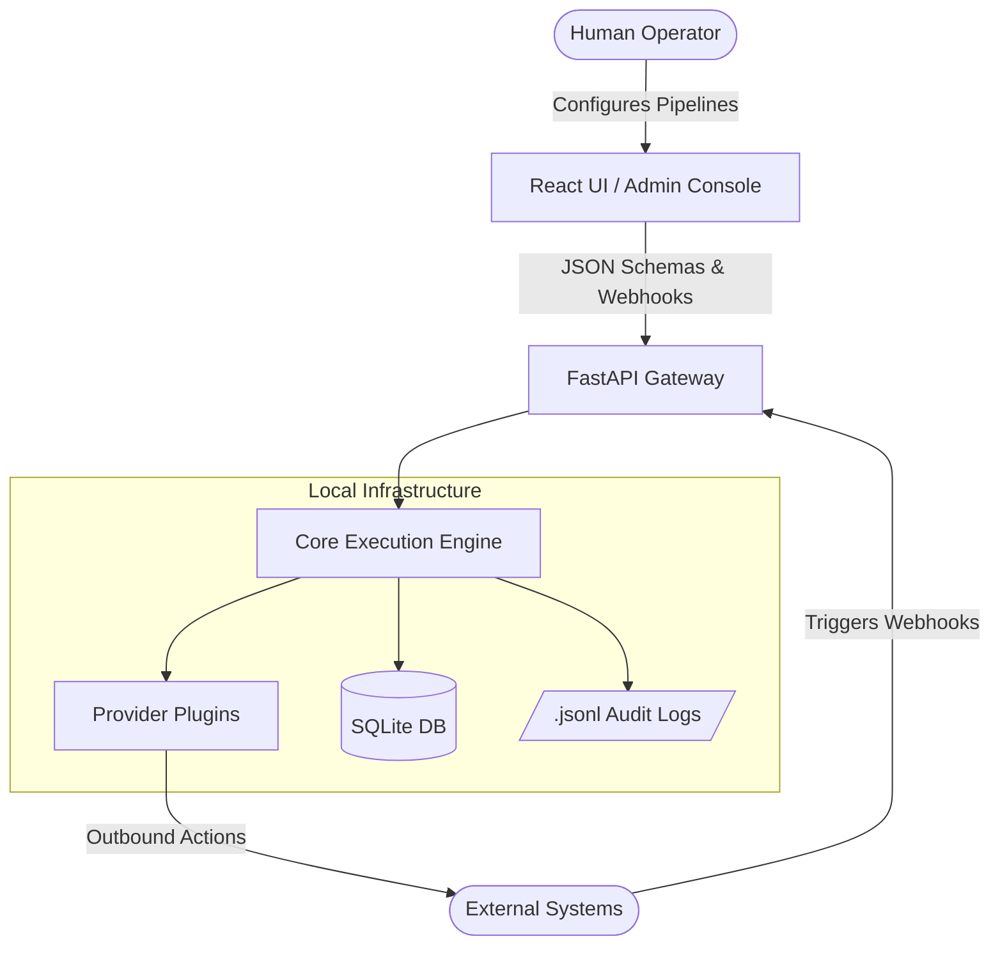
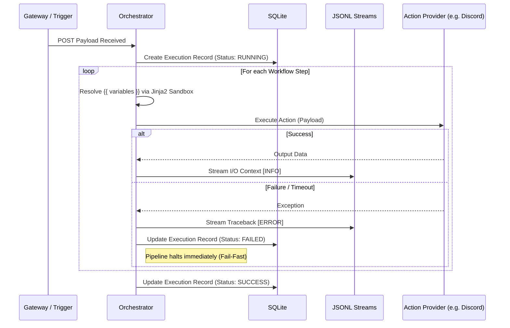

# ⚙️ Workflow Automation Engine


A self-hosted, local-first automation platform that enables users to connect triggers and actions into automated pipelines. Built as a lightweight, privacy-focused alternative to cloud providers like Zapier or n8n, this engine enables users to connect triggers and actions into configurable linear automation pipelines while keeping your data and execution context entirely within your own local infrastructure.

---

## 📖 Table of Contents
- [Project Vision](#-project-vision)
- [Key Engineering Features](#-key-engineering-features)
- [System Architecture](#-system-architecture)
- [Technology Stack](#-technology-stack)
- [Documentation](#-documentation)
- [Getting Started](#-getting-started)
- [Future Roadmap](#-future-roadmap)

---

## 🎯 Project Vision
The goal of this platform is to provide zero-cost, private workflow execution. Rather than building a monolithic SaaS application, this project was architected as an **infrastructure-level orchestration engine**. It strictly separates the presentation layer from the execution engine, utilizing configuration-driven design and dynamic plugins.

---

## ⭐ Highlights

- Dynamic plugin discovery (Open/Closed Principle)
- Schema-driven React UI powered by backend metadata
- Configuration-driven workflow execution
- Fail-fast orchestration engine
- Secure Jinja2 sandboxed template rendering
- Automatic retry, timeout, and delay policies
- Structured JSONL observability
- Dockerized deployment


---

# 📸 Application Preview

## Dashboard

The operational dashboard provides an overview of workflow health, execution statistics, and recent activity.

<p align="center">
    
</p>

---

## Workflow Management

Create, activate, edit, and manage workflow pipelines.

<p align="center">
    
</p>

---

## Workflow Editor

The linear workflow editor allows users to configure triggers and actions. Selecting a node automatically renders its configuration form using backend-provided schemas.

<p align="center">
    
</p>

---

## Dynamic Provider Configuration

Configuration forms are generated dynamically from Pydantic schemas exposed by the backend.

<p align="center">
    
</p>

---

## Execution History

Inspect every workflow execution with statuses, timestamps, and execution duration.

<p align="center">
    
</p>

---

## Execution Inspector

Drill down into each execution to inspect every step, payload, and execution result.

<p align="center">
    
</p>

---

## 🚀 Key Engineering Features

* **Schema-Driven Dynamic UI:** The React frontend contains zero hardcoded business logic for integrations. It acts purely as a rendering engine, dynamically generating configuration forms on the fly based on Pydantic JSON schemas served by the FastAPI backend.
* **Dynamic Plugin Architecture (Open/Closed Principle):** New integrations (Triggers/Actions) are added simply by dropping a new Python class into the `providers/` folder. The backend auto-discovers the plugin, parses its metadata, and instantly serves it to the frontend canvas.
* **ACID Transactional State Management:** Drag-and-drop workflow updates are handled via bulk-sync endpoints, guaranteeing database integrity and preventing orphaned data on network drops.
* **Fail-Fast Orchestration & Sandboxed Context:** The engine enforces a strict linear pipeline. If an external API fails, the orchestrator safely halts execution, prevents downstream data corruption, and securely parses variables using a Sandboxed Jinja2 environment.
* **Hybrid Storage & Observability:** High-level run statuses are stored in SQLite for rapid UI indexing, while heavy context trace data (I/O payloads, unhandled exceptions) are streamed directly to line-delimited `.jsonl` files.

---

## 🏛️ System Architecture

The architecture relies on a unidirectional, heavily decoupled flow where the core engine never knows the implementation details of the UI or the plugins.

### High-Level System Context



### Execution Flow (Fail-Fast Pipeline)



---

## 💻 Technology Stack

### Frontend (Administration Console)

* **Framework:** React 18, TypeScript, Vite
* **State Management:** Zustand (Transient canvas state) + TanStack React Query (Server-state caching)
* **Styling:** Tailwind CSS, Lucide Icons

### Backend (Orchestration Engine)

* **Core:** Python 3.11+, FastAPI
* **Database & ORM:** SQLite, SQLAlchemy, Pydantic
* **Execution & Safety:** APScheduler (Cron), Jinja2 (Sandboxed Variable Injection)
* **Logging:** Native Python logging to chunked `.jsonl` files

### Infrastructure

* **Deployment:** Multi-stage Docker builds, Docker Compose, Nginx reverse proxy

---

## 📚 Documentation

Detailed architectural decisions and design patterns are documented in the `docs/` folder:

* [System Context & Architecture](docs/architecture/01-system-context.md)
* [Entity-Relationship Diagram](docs/database/01-er-diagram.md)
* [Workflow Execution State Machine](docs/workflows/02-workflow-execution-flow.md)
* [Frontend System Design](docs/design/01-frontend-architecture.md)
* [Coding Standards & ADRs](docs/development/coding-standards.md)

---

## 🛠️ Getting Started

The entire engine is containerized for a one-click deployment.

```bash
# 1. Clone the repository
git clone [https://github.com/yourusername/workflow-automation-engine.git](https://github.com/yourusername/workflow-automation-engine.git)
cd workflow-automation-engine

# 2. Spin up the infrastructure via Docker Compose
docker-compose up -d --build

# 3. Open your browser and navigate to:
http://localhost:5173

```

---

## 🚀 Project Status


Version 2.5 represents the intended scope of this project.

The primary objective was to design and implement a production-style,
local-first workflow automation engine that demonstrates clean software
architecture, plugin extensibility, and dynamic configuration rather than
feature parity with existing automation platforms.

Future improvements remain possible, but the core architectural goals of
the project have been successfully completed.

---

## 🚀 Future Enhancements

Potential future improvements include:

- Additional Trigger providers
- Additional Action providers
- PostgreSQL backend
- Authentication and user management
- Team collaboration
- Provider marketplace

Large-scale workflow graphs (DAGs) were intentionally excluded from the
project scope to keep the engine focused on demonstrating clean,
maintainable architecture for sequential workflow execution.