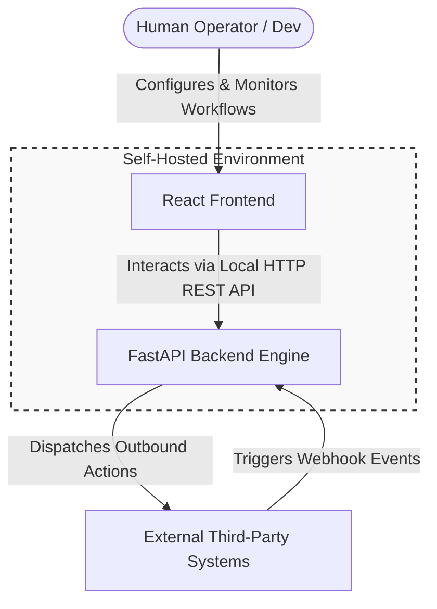

# Architecture: System Context

The System Context diagram sets the highest boundary for the Workflow Automation Engine. It defines how human operators and external integrations interact with the core self-hosted application boundaries.

## System Context Diagram

# System Boundaries & Actors

## 1.The Human Operator (User)
- ***Role***: Interacts directly with the platform through a local web application.  
- ***Responsibility***: Build linear execution paths, manage step order , configure step settings , inspect failure logs, and monitor execution lists.  

## 2. External Third-Party Systems

- ***Inbound Role***: Functions as an event emitter sending asynchronous payloads to the platform's exposed webhook endpoints.  
- ***Outbound Role***: Acts as a destination target receiving processed structural transformations, context evaluations, or side effects from execution nodes.  

## 3. Self-Hosted Application Boundary
- Contains all computation and execution data entirely within user-controlled machinery, achieving data isolated boundaries, minimized data transit latency, and zero per-execution operational overhead.  