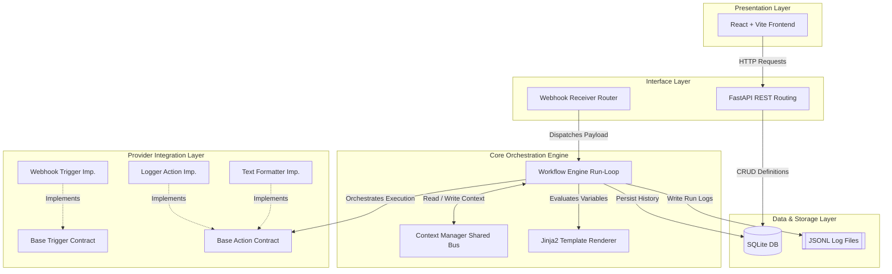

# Architecture: High-Level Architecture

This document describes the global data flow and structural layers of the Workflow Automation Engine. The platform utilizes a strictly decoupled, unidirectional layered architecture where control flows downward from presentation to execution.

## Global Architecture Diagram

## Layer Responsibilities

### 1.Presentation Layer
- ***Technology***: React, TypeScript, Vite, Tailwind CSS.
- ***Responsibility***: Provides a minimal, low-overhead administrative view for creating linear execution paths, configuring individual step variables, and reviewing step-by-step audit histories. It serves strictly as a tool for visualization and configuration; no workflow engine execution logic resides here.  

### 2. Interface Layer (API)
- ***Technology***: FastAPI.  
- ***Responsibility***: Exposes a thin HTTP REST routing layer. It provides endpoints for workflow lifecycle operations (CRUD) and handles incoming webhook calls from external third-party systems, mapping inbound network data payloads directly into the orchestration core.  

### 3. Core Orchestration Engine
- ***Technology***: Python (Core Engine Domain).  
- ***Responsibility***: The heart of the platform. It sequences steps, isolates operational step runtime boundaries, manages execution transitions, and maintains the safe shared data bus (Context). The core remains deliberately agnostic to third-party implementation specifics.  

### 4. Provider Integration Layer
- ***Technology***: Abstract Base Classes (Python ABC).
- ***Responsibility***: Defines standardized contracts for system actions and triggers. Individual blocks (e.g., text formatting tools or log outputs) implement these boundaries, creating an extensible structure that can accommodate new node variations without changing core runtime code.  

### 5. Data & Storage Layer
- ***Technology***: SQLite (via SQLAlchemy) and local JSONL log files.  
- ***Responsibility***: Stores local-first application configurations and sequential history metrics securely on single-tenant host storage. Step run payloads are explicitly logged to line-delimited JSON streams to protect database longevity.  