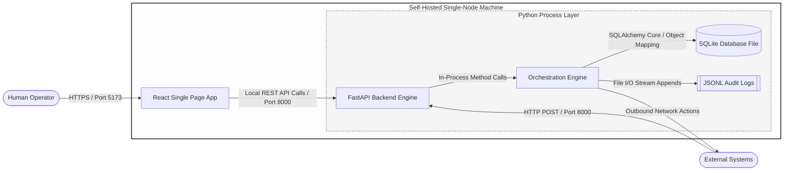

# Architecture: Container Diagram

The Container diagram models the high-level deployment architecture, execution runtimes, and local communication protocols within a single self-hosted node environment.

## 🎨 Container Diagram

---

## 🗒️ Technical Specification & Communication Protocol

| **Container Name** | **Runtime Environment** | **Storage Type** | **Communication Protocol** | **Access Boundary** |
|:-------------------|:------------------------|:----------------:|---------------------------:|--------------------:|
| **React SPA** | Web Browser / Node Host | Ephemeral Memory | HTTP / JSON | Exposed locally to user network |
| **FastAPI Backend Engine** | Python 3.11+ / Uvicorn | In-Memory Core Run-Loop | HTTP REST / Webhook Ports | Internal network; webhooks exposed |
| **SQLite Database** | Local File System (`.db`) | Relational Storage Engine | Native File-system Call (POSIX) | Internal file access bounds only |
| **JSONL Logs** | Local File System (`.jsonl`) | Text Append Buffers | Line-Delimited File Append Stream | Internal file access bounds only |

---

## 🪛 Architecture Characteristics

### Local-First Data Privacy
Because all data processing containers reside on the user's private physical hardware, no processing contexts, token headers, or database rows leave the local infrastructure boundary. This design effectively mitigates security concerns regarding third-party transit risks.  

### Minimal Structural Latency
Traditional automation setups rely on periodic network polling to detect remote events, which can introduce message processing delays. By placing the FastAPI endpoint and the runtime loop within the same in-process boundary, incoming webhook notifications trigger immediate execution pipelines without network polling hops.  