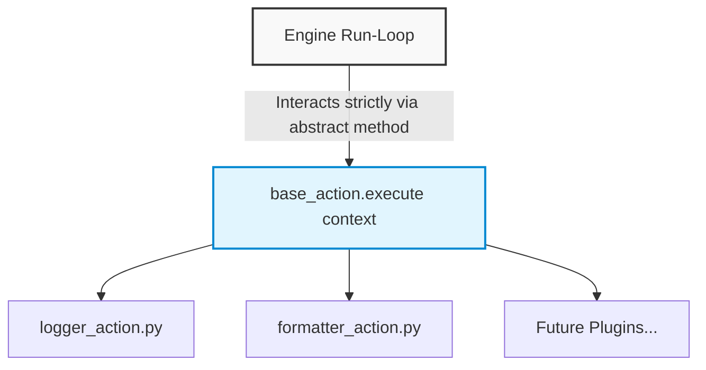

# Architecture: Backend Architecture
This document maps out the logical component boundaries, file directory structures, and decoupled layers within the `backend/` engine workspace

## Component Structural Mapping

The backend follows the Service-Layer pattern, keeping routes thin and encapsulating execution state changes cleanly within the core engine domain.

```text
backend/
├── api/                        # Interface Layer
│   └── routes/                 # Thin routing blocks (REST endpoints & Webhook entries)
├── services/                   # Application Service Layer (Business rules, Workflow CRUD)
├── engine/                     # Core Orchestration Domain
│   ├── workflow_engine.py      # Main pipeline sequencer and loop controller
│   ├── context_manager.py      # Isolated shared execution data context manager
│   ├── template_renderer.py    # Safe variable substitution via Jinja2 sandboxing
│   └── execution_tracker.py    # Runtime execution status and DB metrics persistency
├── providers/                  # Extensible Integration Module
│   ├── triggers/               # Inbound event contracts and definitions
│   │   ├── base_trigger.py     # Trigger base class contract
│   │   └── webhook_trigger.py  # Webhook payload parser implementation
│   └── actions/                # Outbound transformation and storage steps
│       ├── base_action.py      # Action base class contract
│       ├── logger_action.py    # Execution monitoring/debugging output node
│       └── formatter_action.py # String template variable injector
├── database/                   # Persistence Layer
│   ├── models/                 # SQLAlchemy structural data definitions
│   └── schemas/                # Pydantic data verification contracts
├── core/                       # Global engine setup (Configuration variables, constants)
├── logs/                       # Target directory for local JSONL files
└── main.py                     # App entry point initializing FastAPI runtime

```

---

## Component Isolation Boundaries

### API Layer vs. Engine Layer

The API layer routes (`backend/api/routes/`) handle HTTP transformations and request-response parsing. Once an action or workflow trigger is validated, execution control shifts immediately to the engine domain (`backend/engine/`). The route layer remains completely unaware of how steps are combined, context is carried, or templates are evaluated.

### Core Engine Loop vs. Provider Subsystems

The `WorkflowEngine` never contains hardcoded references to specific provider steps. It interacts exclusively with abstract interfaces defined in `base_trigger.py` and `base_action.py`.



This clean boundary allows developers to drop in new functional actions or triggers without editing or risking regressions in the underlying core step sequencer loop.

---

## Local Structured Logging Strategy

To keep the transactional SQLite engine from choking on large text data strings or execution runtime dumps, details are isolated using a split logging pattern:

* **High-Level Run Status:** States like `PENDING`, `RUNNING`, `SUCCESS`, and `FAILED` are saved directly to the relational database to power index lists in the UI.


* **Detailed Context & Error Trapped Traces:** Comprehensive variables, input/output logs, and debug details are written directly to line-delimited `.jsonl` text streams. This keeps database storage light and optimizes trace performance.


