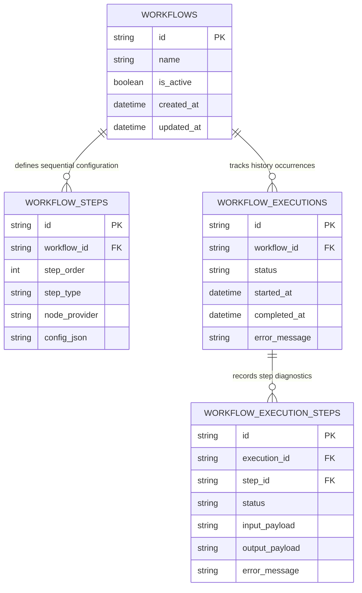

# Database: Entity-Relationship Diagram

This document models the persistent relational storage strategy optimized for local-first operations using an embedded SQLite engine.

## Relational Entity-Relationship Diagram

---

## Schema Structural Design Rules

* **Enforced Linearity:** To minimize data footprint during structural changes, the database excludes complex pointer paths or parent node ID keys. Step order is managed by sequential integers (`step_order`).

* **Hybrid Storage Layout:** Core execution parameters (`status`, `workflow_id`) are stored as indexable relational columns for fast dashboard performance. Large string parameters and run traces are written to decoupled local JSONL files to keep the main `.db` database lightweight.
