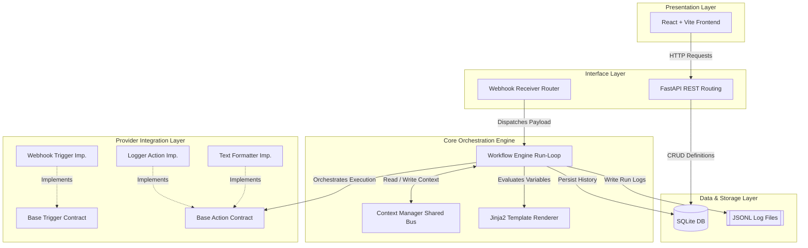

```mermaid
graph TD
    %% Presentation Layer
    subgraph UI [Presentation Layer]
        ViteUI[React + Vite Frontend]
    end

    %% API Gateway / Routing Layer
    subgraph API [Interface Layer]
        FastAPI[FastAPI REST Routing]
        Webhooks[Webhook Receiver Router]
    end

    %% Core Application Domain
    subgraph Core [Core Orchestration Engine]
        Engine[Workflow Engine Run-Loop]
        CtxManager[Context Manager Shared Bus]
        Renderer[Jinja2 Template Renderer]
    end

    %% Extensible Provider Ecosystem
    subgraph Providers [Provider Integration Layer]
        BaseTrigger[Base Trigger Contract]
        BaseAction[Base Action Contract]
        WebhookTrig[Webhook Trigger Imp.]
        LoggerAct[Logger Action Imp.]
        FormatAct[Text Formatter Imp.]
    end

    %% Data Isolation Boundary
    subgraph Data [Data & Storage Layer]
        SQLite[(SQLite DB)]
        JSONL[[JSONL Log Files]]
    end

    %% Interactions
    ViteUI -->|HTTP Requests| FastAPI
    Webhooks -->|Dispatches Payload| Engine
    FastAPI -->|CRUD Definitions| SQLite
    
    Engine <-->|Read / Write Context| CtxManager
    Engine -->|Evaluates Variables| Renderer
    Engine -->|Orchestrates Execution| BaseAction
    
    %% Fixed Lines: Using standard dotted or solid arrows with text labels
    WebhookTrig -.->|Implements| BaseTrigger
    LoggerAct -.->|Implements| BaseAction
    FormatAct -.->|Implements| BaseAction
    
    Engine -->|Write Run Logs| JSONL
    Engine -->|Persist History| SQLite
```