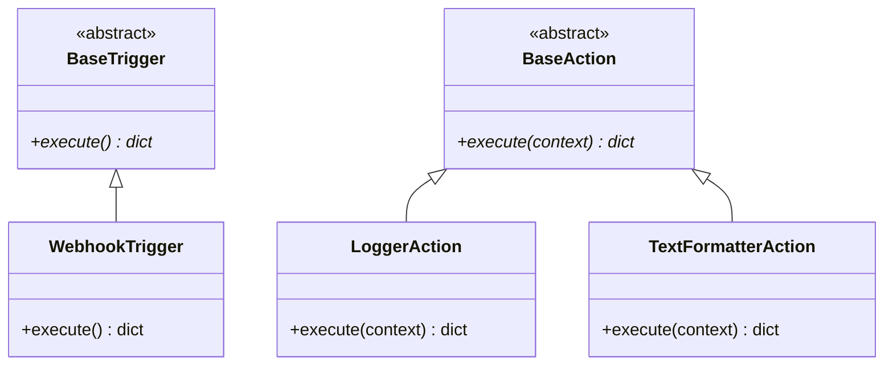

# Engine: Provider Architecture

The Workflow Automation Engine relies on a plugin-based provider pattern. All operational behaviors are implemented through specialized extensions that plug directly into standard core system interfaces.

## Class Hierarchies and Interface Contracts



---

## Technical Specifications

### 1. Inbound Base Trigger Interface

Triggers are responsible for initiating pipelines and producing the root data payload.

```python
class BaseTrigger(ABC):
    @abstractmethod
    async def execute(self) -> dict:
        """
        Listens for or parses an external environment boundary event.
        Returns a dict payload that seeds the root workflow context under 'trigger'.
        """
        pass

```

### 2. Outbound Base Action Interface

Actions accept the current context object, run data mutations, and return step updates.

```python
class BaseAction(ABC):
    @abstractmethod
    async def execute(self, context: dict) -> dict:
        """
        Executes business logic using the current shared data context.
        Returns a dictionary containing step-specific results to append to the context.
        """
        pass

```

---

## Core MVP Registry Providers

The baseline engine limits core providers to three foundational elements:

1. **Webhook Trigger:** Exposes an HTTP endpoint wrapper that translates inbound raw requests into the primary context payload.

2. **Text Formatter Action:** Resolves string variables inside configuration fields using a sandboxed templating engine.

3. **Logger Action:** Outputs structured context objects directly to system logs for real-time debugging and verification.