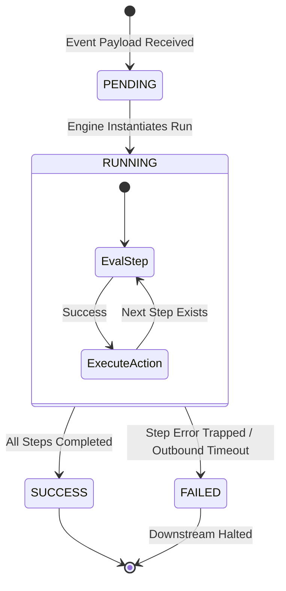

# Workflows: Workflow Execution Flow

This document details the lifecycle, state-machine transitions, and error-handling steps of a live workflow execution instance.

## Execution Runtime State Machine

Every workflow run instance operates as an isolated execution thread managed by the core engine loop. The process moves through the following explicit states:

---

## Sequential Loop Execution Steps

### 1. Event Initialization & Ingestion

An external system POSTs a payload to the application gateway webhook router. The router identifies the targeted workflow, verifies its activation flag, and writes an initial run log marked as `PENDING`.

### 2. Run Instantiation

The runtime loop pulls the sequence of step configurations sorted by ascending index values. It spins up an in-memory execution run log tracking object and upgrades the execution state flag to `RUNNING`.

### 3. Isolated Execution Steps

For every step configuration in the array:

* The input data string is parsed and evaluated using current shared run contexts.

* The underlying provider code block fires inside an isolated code safety block.

* Execution tracking tables update step results asynchronously.

---

## Error Trapping and Failure Isolation Philosophy

The platform operates on a **fail-fast architecture**. A pipeline crash at any step stops downstream progress to prevent corrupted data from flowing into external applications:

1. 
**Immediate Execution Halt:** If any trigger evaluation or action plugin throws an unhandled exception or encounters an internal timeout, the processing loop halts immediately. Downstream steps are marked as unexecuted.

2. 
**State Transition Capture:** The global status record drops to `FAILED`. The exact crash message, call trace text, and input state parameters are written to the database execution logs and the `.jsonl` audit streams.

3. 
**No Silent Ignorance:** The application engine will never catch errors silently to continue executing a broken pipeline. Every failure is fully auditable, deterministic, and traceable via the admin workspace UI.

